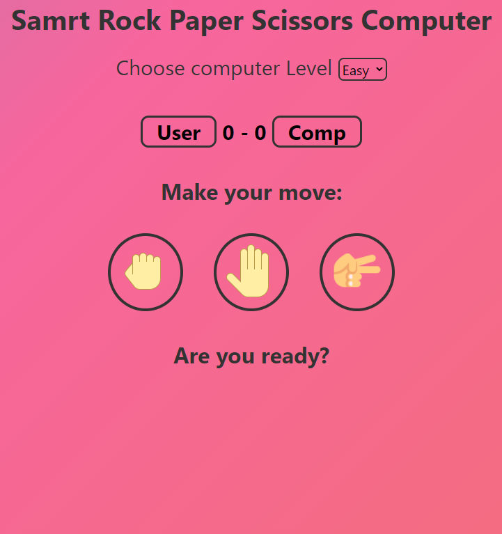

# Rock-Paper-Scissors
A tiny Web game project in order to learn HTML, CSS and JavaScript.

  

There are two level of the computer, Easy and Hard. Easy level is just a random choice, while the interesting part is the Hard mode. In the Hard mode, the computer would memorize the user's input and maintain a distribution of it, which means the computer keeps track of the user's input and if the user has a preference on a particular move, the computer would be aware of that and sample on the opposite move more. And theoretically, the computer would beat the user in the long run.

